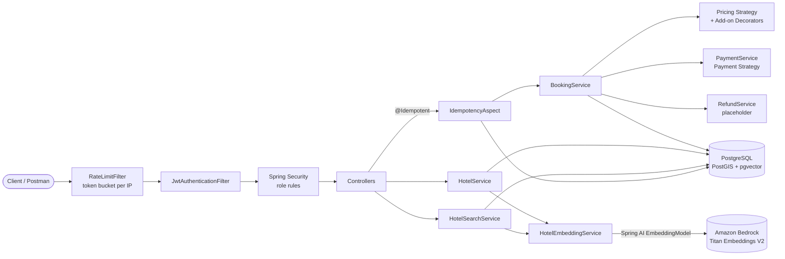
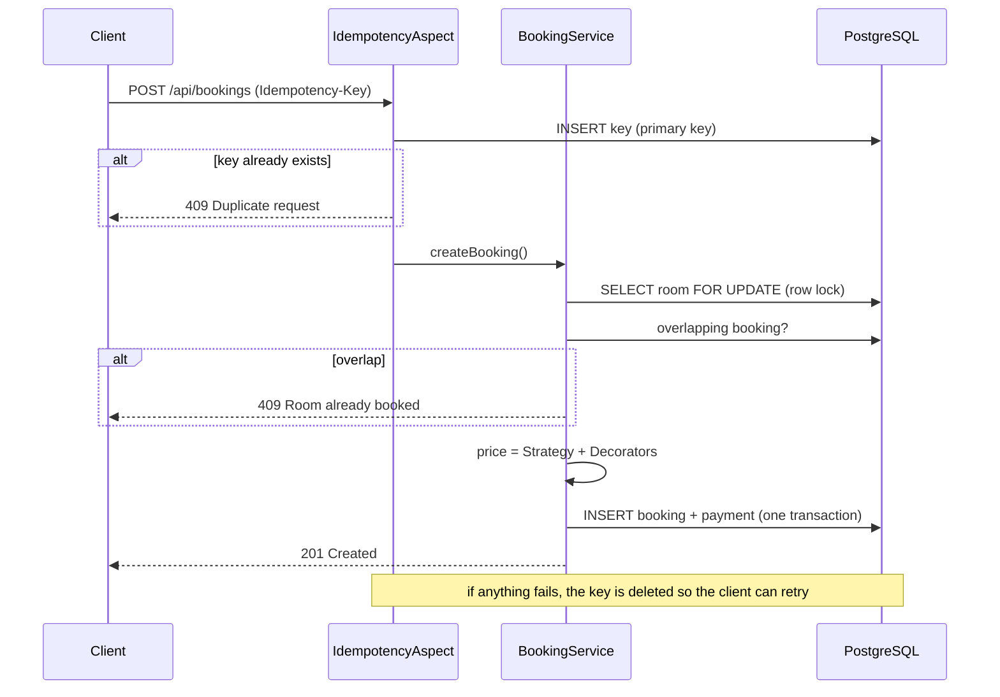

# Hotel Booking Platform

A Spring Boot REST API for searching and booking hotels. Beyond the usual CRUD, it handles the hard parts of a booking system: **concurrent double-booking**, **duplicate requests**, **abuse/rate limiting**, **role-based security** — and two modern search features:

- **Geo search (PostGIS)** — *"find hotels within 5 km of this GPS coordinate"*, with exact distances, backed by a spatial index.
- **Search by Vibe (pgvector + Spring AI)** — type what you want in plain language, e.g. *"a quiet, romantic boutique hotel near Cubbon Park with a great breakfast"*, and hotels are ranked by meaning using text embeddings and cosine similarity.

      

---

## Table of contents

- [Features](#features)
- [Tech stack](#tech-stack)
- [Architecture](#architecture)
- [Getting started](#getting-started)
- [API reference](#api-reference)
- [Examples](#examples)
- [Testing](#testing)
- [Configuration](#configuration)
- [Design decisions](#design-decisions)
- [Project structure](#project-structure)
- [Roadmap](#roadmap)
- [Project history](#project-history)

---

## Features

### Search
| Feature | How it works |
|---|---|
| Filter search | Optional name / city / state / country / min-rating filters built with JPA `Specification`s |
| **Geo search** | PostGIS `ST_DWithin` + `ST_Distance` on a `geography(Point, 4326)` column, GIST-indexed, nearest first, distances in km |
| **Search by Vibe** | Hotel description + amenities + location are embedded into a 1024-dim vector (Amazon Titan Text Embeddings V2 on Bedrock, through Spring AI). Queries are embedded the same way and ranked by pgvector cosine distance on an HNSW index |
| Hybrid search | Vibe search can be restricted to a radius — *"romantic hotels within 5 km of me"* — in a single SQL query |
| Availability | Rooms free for a date range (excludes maintenance and overlapping bookings) |

### Booking
- **No double-booking under concurrency** — the room row is locked (`PESSIMISTIC_WRITE`) before the overlap check.
- **Correct overlap rules** — half-open date ranges: checking in on someone else's check-out day is allowed.
- **Atomic booking + payment** — one transaction; a failed payment rolls the booking back.
- **Idempotent `POST /api/bookings`** — an `Idempotency-Key` header stops double-clicks and network retries from creating duplicates (`409`). Failed requests release their key, so the client can safely retry.
- **Dynamic pricing** — Strategy pattern: standard pricing, or +15% on Saturday/Sunday nights.
- **Add-ons** — Decorator pattern: breakfast (+30), airport pickup (+80), stackable.
- **Payments** — Strategy pattern: UPI and credit card.
- **Cancellation** — owners (or admins) can cancel; refund processing is a placeholder for now.

### Verified reviews
- **Only real guests** — a review is tied to one booking: only its owner can write it, the booking must be `CONFIRMED`, and only from the check-in date. One review per stay.
- **Public reading** — anyone can read a hotel's reviews (paged, newest first); reviewers show as "Alice J.", never by email.
- **Live rating** — a hotel's `rating` becomes the average of its reviews (with `reviewCount`); until the first review it shows the initial rating. The hotel row is locked while the average is recomputed, so concurrent reviews can't skew it.
- **Edit / delete** — authors can edit or delete their own review, admins can delete any; cancelling a booking removes its review.

### Security & reliability
- Stateless **JWT** auth (HS256, 24 h), **BCrypt** passwords, roles `USER` / `ADMIN`.
- **Ownership checks** — the booking user comes from the token, never the request body; users can only see or cancel their own bookings.
- Self-registration can never grant `ADMIN`.
- **Per-IP rate limiting** (token bucket, Bucket4j) → `429`.
- Graceful AI degradation — if the embedding model is down, hotels are still created, vibe search returns `503`, and missing embeddings are backfilled on startup or on demand.
- Consistent error codes: `400 · 401 · 403 · 404 · 409 · 429 · 503`.

---

## Tech stack

| Layer | Technology |
|---|---|
| Language / framework | Java 21, Spring Boot 3.4 (Web, Data JPA, Validation, Security, AOP) |
| Database | PostgreSQL 17 + **PostGIS** + **pgvector** |
| AI | **Spring AI 1.0** `EmbeddingModel` → **Amazon Bedrock** (Titan Text Embeddings V2, 1024 dims) |
| Auth | Spring Security, JJWT, BCrypt |
| Rate limiting | Bucket4j |
| Testing | JUnit 5, MockMvc, **Testcontainers**, AssertJ, Postman / Newman |
| Infra | Docker Compose (multi-arch image, runs natively on Apple Silicon) |

---

## Architecture



**Booking flow**



**How vibe search works**

1. When a hotel is added, its name, location, rating, description and amenities are turned into one text and embedded into a 1024-number vector, stored in a `vector(1024)` column.
2. A search query is embedded the same way.
3. PostgreSQL ranks hotels by cosine distance (`embedding <=> query`) using an HNSW index; `matchScore = 1 − distance`.

---

## Getting started

### Prerequisites
- Java 21
- Docker Desktop (or any Docker engine)

### Run

```bash
# 1. Start PostgreSQL (PostGIS + pgvector) on :5433
docker compose up -d

# (optional) AWS credentials for vibe search via Bedrock; without them vibe search returns 503
aws configure            # region ap-south-1, or set AWS_REGION

# 2. Start the API on :8080
./mvnw spring-boot:run
```

On startup the app creates the PostGIS/pgvector columns and indexes, seeds demo data, and generates embeddings for the demo hotels.

```bash
curl http://localhost:8080/api/public/health
# {"status":"UP","message":"Public API is available"}
```

### Demo data

| | |
|---|---|
| Users | `alice@example.com` / `password123`, `bob@example.com` / `password123` |
| Admin | `admin@example.com` / `admin123` |
| Hotels | New York, Boston, and four Bangalore hotels (boutique near Cubbon Park, business in Whitefield, family on MG Road, spa retreat at Nandi Hills) |

> These credentials are for local development only.

Stop everything with `docker compose down` (add `-v` to also delete the database and the downloaded model).

---

## API reference

🔓 public · 👤 logged-in user · 🛡️ admin

### Auth
| Method | Endpoint | Access | Description |
|---|---|---|---|
| POST | `/api/auth/register` | 🔓 | Register (always creates a `USER`) |
| POST | `/api/auth/login` | 🔓 | Returns a JWT |

### Hotels & search
| Method | Endpoint | Access | Description |
|---|---|---|---|
| GET | `/api/hotels/{id}` | 🔓 | Hotel details |
| GET | `/api/hotels/{id}/rooms` | 🔓 | Rooms of a hotel |
| GET | `/api/hotels/{id}/rooms/available?checkIn=&checkOut=` | 🔓 | Rooms free for the dates |
| GET | `/api/hotels/search?name=&city=&state=&country=&minRating=` | 🔓 | Filter search (all optional) |
| GET | `/api/hotels/nearby?lat=&lng=&radiusKm=5&limit=20` | 🔓 | **Geo search**, nearest first |
| GET | `/api/hotels/vibe-search?q=&limit=10[&lat=&lng=&radiusKm=]` | 🔓 | **Semantic search**, optional radius |

### Bookings
| Method | Endpoint | Access | Description |
|---|---|---|---|
| POST | `/api/bookings` | 👤 | Create booking — requires `Idempotency-Key` header |
| GET | `/api/bookings/{id}` | 👤 owner / 🛡️ | Booking details |
| DELETE | `/api/bookings/{id}` | 👤 owner / 🛡️ | Cancel booking |
| GET | `/api/bookings/me` | 👤 | My bookings |
| GET | `/api/users/{userId}/bookings` | 👤 self / 🛡️ | A user's bookings |

### Reviews
| Method | Endpoint | Access | Description |
|---|---|---|---|
| GET | `/api/hotels/{id}/reviews?page=0&size=10` | 🔓 | A hotel's reviews, newest first |
| POST | `/api/bookings/{id}/review` | 👤 owner | Review a stay — `{"rating":1-5,"comment":"..."}`; confirmed booking, from check-in day, once |
| PUT | `/api/reviews/{id}` | 👤 author | Edit your review |
| DELETE | `/api/reviews/{id}` | 👤 author / 🛡️ | Delete a review |
| GET | `/api/reviews/me` | 👤 | My reviews (with `bookingId`) |

### Admin
| Method | Endpoint | Access | Description |
|---|---|---|---|
| POST | `/api/admin/hotels/add` | 🛡️ | Add a hotel (embedding generated automatically) |
| POST | `/api/admin/hotels/{id}/rooms` | 🛡️ | Add a room |
| POST | `/api/admin/hotels/embeddings/refresh?onlyMissing=true` | 🛡️ | Backfill / rebuild embeddings |

### Other
| Method | Endpoint | Access | Description |
|---|---|---|---|
| GET | `/api/public/health` | 🔓 | Health check |

---

## Examples

**Log in**
```bash
TOKEN=$(curl -s -X POST localhost:8080/api/auth/login \
  -H 'Content-Type: application/json' \
  -d '{"email":"alice@example.com","password":"password123"}' | jq -r .token)
```

**Hotels within 5 km of Cubbon Park, Bangalore**
```bash
curl "localhost:8080/api/hotels/nearby?lat=12.9763&lng=77.5929&radiusKm=5"
```
```json
[
  { "hotel": { "id": 3, "name": "The Cubbon Courtyard", "city": "Bangalore", "...": "..." }, "distanceKm": 0.39 },
  { "hotel": { "id": 5, "name": "MG Road Grand", "city": "Bangalore", "...": "..." }, "distanceKm": 1.52 }
]
```

**Search by vibe**
```bash
curl -G localhost:8080/api/hotels/vibe-search \
  --data-urlencode "q=A quiet, romantic boutique hotel near Cubbon Park with a great breakfast" \
  --data-urlencode "limit=3"
```
```json
[
  { "hotel": { "name": "The Cubbon Courtyard", "...": "..." }, "matchScore": 0.8386 },
  { "hotel": { "name": "Whitefield Tech Suites", "...": "..." }, "matchScore": 0.6639 },
  { "hotel": { "name": "MG Road Grand", "...": "..." }, "matchScore": 0.6407 }
]
```

**Book a room** (2 weekday nights × 150 + breakfast 30 = 330)
```bash
curl -X POST localhost:8080/api/bookings \
  -H "Authorization: Bearer $TOKEN" \
  -H "Idempotency-Key: $(uuidgen)" \
  -H 'Content-Type: application/json' \
  -d '{"roomId":4,"checkIn":"2026-10-12","checkOut":"2026-10-14","addOns":["BREAKFAST"],"paymentMethod":"UPI"}'
```

---

## Testing

```bash
./mvnw test                           # 31 tests; needs Docker running (Testcontainers), not AWS
./mvnw test -Dtest=HotelSearchIntegrationTest
```

- **Unit tests** — pricing strategies and add-on decorators.
- **Integration tests** — run against a real PostgreSQL + PostGIS + pgvector container (built from the same `docker/postgres/Dockerfile`), covering auth, access control, idempotency, booking conflicts, cancellation, admin, geo and vibe search. A deterministic fake embedding model replaces Bedrock, including simulated outages.

**End-to-end against the running app**

```bash
RATE_LIMIT_PER_MINUTE=1000 ./mvnw spring-boot:run   # default limit (10/min) is too low for a test run
./api-tests/smoke-test.sh                          # 53 checks, prints PASS/FAIL
```

Or import `api-tests/HotelBooking.postman_collection.json` into Postman and run the collection (39 requests, 45 assertions; tokens, IDs and dates are filled in automatically). It also runs headless with Newman:

```bash
npx newman run api-tests/HotelBooking.postman_collection.json
```

---

## Configuration

All settings live in `src/main/resources/application.yml`; the common ones can be overridden with environment variables.

| Env variable | Default | Purpose |
|---|---|---|
| `DB_URL` | `jdbc:postgresql://localhost:5433/hotelbooking` | Database URL |
| `DB_USERNAME` / `DB_PASSWORD` | `hotelbooking` / `hotelbooking` | Database credentials |
| `JWT_SECRET` | dev-only value | JWT signing key (≥ 32 chars) — **set this outside local dev** |
| `AWS_REGION` | `ap-south-1` | Bedrock region for embeddings (credentials from the default AWS chain) |
| `RATE_LIMIT_PER_MINUTE` | `10` | Requests per minute per IP |

Other settings under `app.*`: JWT expiry, max geo radius (100 km), embedding dimensions, startup embedding backfill.

---

## Design decisions

- **Pessimistic locking for bookings.** Double-booking is a correctness bug, not a performance trade-off; locking the room row makes the availability check and insert safe without retry logic.
- **Idempotency key committed before the business logic.** The database primary key is the arbiter, so two identical requests at the same instant can't both run. The aspect runs outside the booking transaction, and deletes the key if the booking fails so retries work.
- **`geography`, not `geometry`.** Distances come back in metres on the real globe instead of degrees.
- **Generated `location` column.** The PostGIS point is computed from `latitude`/`longitude` by the database, so it can never go out of sync.
- **Embeddings kept off the JPA entity.** The 1024-float vector is only read and written through native queries, so normal hotel/booking reads don't load it.
- **Hotel creation doesn't depend on the AI model.** The hotel is saved first and embedded after; if Bedrock is unreachable it is backfilled later.
- **Hosted embeddings.** Bedrock Titan V2 costs fractions of a cent per search and needs no separate model server; the model is swappable through Spring AI configuration.
- **Testcontainers instead of H2.** Spatial and vector SQL can't be tested on an in-memory database.

---

## Project structure

```
src/main/java/com/example/hotelbooking
├── annotation/      @Idempotent
├── aspect/          IdempotencyAspect (AOP)
├── config/          SecurityConfig, EmbeddingBackfillRunner
├── controller/      Auth, Hotel, Booking, AdminHotel, Public
├── decorator/       Booking add-ons (Decorator pattern)
├── dto/             Request / response objects
├── entity/          JPA entities
├── exception/       Custom exceptions + GlobalExceptionHandler
├── filter/          RateLimitFilter
├── repository/      Spring Data repositories (+ native PostGIS/pgvector queries)
├── scheduler/       Idempotency key cleanup job
├── security/        JWT utilities and filter
├── service/         Booking, Payment, Refund, Hotel, HotelSearch, HotelEmbedding
└── strategy/        Payment and pricing strategies (Strategy pattern)
src/main/resources
├── db/postgis-pgvector.sql   extensions, geo/vector columns and indexes
└── data.sql                  demo data
docker/postgres/Dockerfile    PostgreSQL 17 + PostGIS + pgvector
api-tests/                    smoke test script + Postman collection
```

---

## Roadmap

- [ ] Refund processing on cancellation (placeholder in `RefundService`)
- [ ] Search UI with a natural-language search bar
- [ ] CI pipeline (GitHub Actions) running the test suite
- [ ] Load and concurrency benchmarks
- [ ] Hybrid ranking (vector similarity + keyword match)

---

## Project history

**Version 1** — core booking system.


**Version 2** — design patterns: Strategy pattern for payment methods and pricing, Decorator pattern for booking add-ons.

**Version 3** — security hardening, idempotent bookings, admin hotel management, PostGIS geo search, pgvector "Search by Vibe" with Spring AI, Docker setup, and Testcontainers integration tests.
